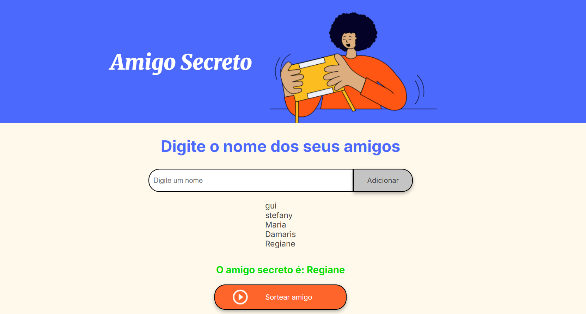

# Amigo Secreto

Este projeto é uma aplicação simples para sortear um "amigo secreto" entre uma lista de nomes inseridos pelo usuário.

## Funcionalidades

- Adicionar nomes à lista.
- Validar entradas vazias.
- Exibir a lista de nomes.
- Sortear um amigo secreto aleatoriamente.

</br>

<div align="center">
  
   <p><em>Aplicação em Operação</em></p>
</div>


## Como Usar

1. Clone o repositório:
   ```bash
   git clone https://github.com/<seu-usuario>/<nome-do-repositório>.git
